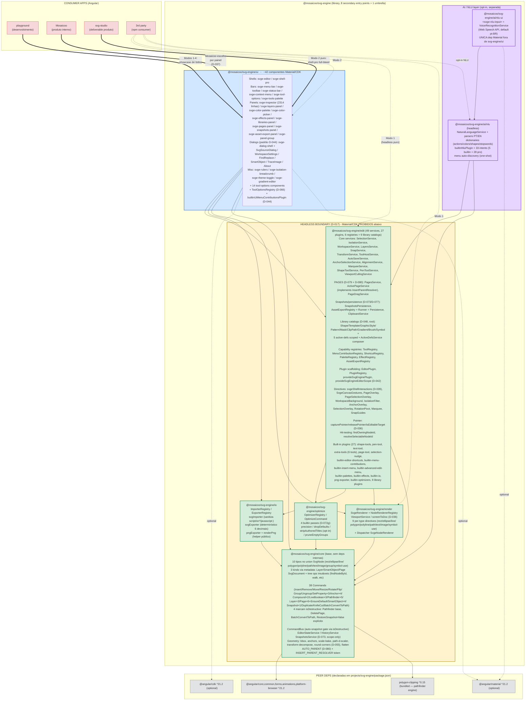
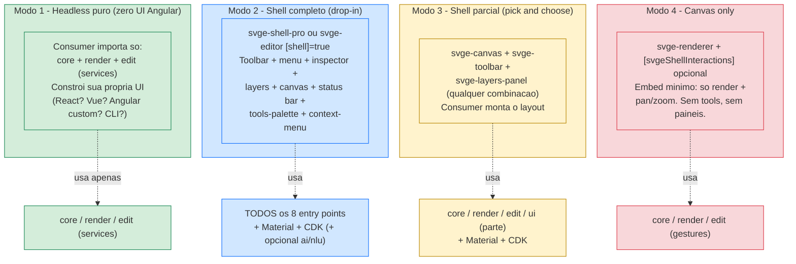

# 02 — Arquitetura

## 1. Visão macro

O **SVGEngine** é um **workspace Angular v21** contendo:

- Uma **library** publicável: `@mosaicoo/svg-engine` (núcleo + UI do editor) com **8 secondary entry points + 1 umbrella** (versão atual 0.1.0).
- **Duas** aplicações consumers (D-041 follow-up de 2026-05-28):
  - `playground` — showcase/sandbox para devs integrando (8 rotas, plugins demo)
  - `svg-studio` — deliverable de produto (full-bleed `<svge-shell-pro>` puro, 1 rota)

## 2. Estrutura real (atualizada 2026-05-29)

```
SVGEngine/
├── .claude/
│   ├── CLAUDE.md                  # guia de boas práticas Angular (auto-gerado)
│   ├── launch.json                # config do dev server para preview tools
│   └── settings.json              # restrições do agente (deny rules)
├── .vscode/
│   ├── extensions.json
│   ├── launch.json
│   ├── mcp.json                   # MCP server do Angular CLI
│   └── tasks.json
├── docs/                          # documentação canônica (01..08)
├── projects/
│   ├── svg-engine/                # library (--prefix=svge)
│   │   ├── src/
│   │   │   ├── lib/
│   │   │   │   ├── svg-engine.ts        # placeholder gerado pelo schematic
│   │   │   │   └── svg-engine.spec.ts
│   │   │   └── public-api.ts            # superfície pública da library
│   │   ├── ng-package.json
│   │   ├── package.json
│   │   ├── tsconfig.lib.json
│   │   ├── tsconfig.lib.prod.json
│   │   └── tsconfig.spec.json
│   ├── playground/                # app demo (--prefix=app, --routing, --style=scss)
│   │   ├── public/                # assets estáticos (favicon, etc.)
│   │   ├── src/
│   │   │   ├── app/
│   │   │   │   ├── app.config.ts        # provedores raiz (30+ plugins, incl. stampToolPlugin demo)
│   │   │   │   ├── app.routes.ts        # 8 rotas + 6 redirects legados + catch-all
│   │   │   │   ├── app.ts
│   │   │   │   ├── app.html             # header banner + <router-outlet>
│   │   │   │   ├── app.scss
│   │   │   │   └── app.spec.ts
│   │   │   ├── index.html               # links Roboto + Material Icons
│   │   │   ├── main.ts                  # bootstrapApplication
│   │   │   └── styles.scss              # tema M3 azure-blue + light dark
│   │   ├── tsconfig.app.json
│   │   └── tsconfig.spec.json
│   └── svg-studio/                # app produto (--prefix=studio) — adicionado 2026-05-28
│       ├── public/                # favicon
│       ├── src/
│       │   ├── app/
│       │   │   ├── app.config.ts        # set de plugins espelhado do playground MENOS demos
│       │   │   ├── app.routes.ts        # 1 rota só ('/') + catch-all redirect (deep-links ⇒ editor)
│       │   │   ├── app.ts               # full-bleed sem header
│       │   │   └── pages/pro-editor/    # único componente, providers: [provideSvgEngineEditorScope()]
│       │   ├── index.html
│       │   ├── main.ts
│       │   └── styles.scss
│       ├── tsconfig.app.json
│       └── tsconfig.spec.json
├── .editorconfig
├── .gitignore
├── .prettierrc
├── angular.json                   # 3 projetos: svg-engine, playground, svg-studio
├── package.json                   # @angular/* @21.2.0, @angular/material @21.x
└── tsconfig.json                  # strict + strictTemplates + flags fortes
```

**Por que 2 apps consumidores** (D-041 follow-up de 2026-05-28):

- **`playground`**: sandbox+showcase para devs integrando a library — mostra todos os modos D-037, inclui plugins demo (`stampToolPlugin`), tem 8 rotas explicando cada Modo, redirects legados de URLs antigas. Audiência: plugin author, dev integrando.
- **`svg-studio`**: deliverable de produto — full-bleed `<svge-shell-pro>` puro, 1 rota só, set de plugins espelhado do playground **menos** demos pedagógicos, deep-links sempre caem no editor. Audiência: end-user.

A coexistência prova um princípio importante do D-041: a library serve dois consumers reais (showcase + produto) sem precisar de fork — só configurações diferentes de `provideSvgEnginePlugin(...)` no bootstrap.

## 3. Estrutura-alvo: multi-entry-point (D-018)

Library dividida em **secondary entry points** via `ng-packagr` para
permitir consumo headless (D-017) e tree-shaking real:

```
projects/svg-engine/
├── ng-package.json                 # primary entry (agregador)
├── package.json
├── src/public-api.ts               # re-exporta de */public-api.ts
├── core/
│   ├── ng-package.json
│   └── src/
│       ├── public-api.ts           # surface de svg-engine/core
│       └── lib/
│           ├── model/              # SvgNode, RectNode, GroupNode, ...
│           ├── commands/           # Command pattern + concrete commands
│           ├── history/            # HistoryService (undo/redo)
│           ├── state/              # EditorStateService (signals)
│           └── types/              # tipos compartilhados (Transform, BBox, ...)
├── render/
│   ├── ng-package.json
│   └── src/
│       ├── public-api.ts           # surface de svg-engine/render
│       └── lib/
│           ├── renderer/           # <svge-renderer> (viewer read-only)
│           └── viewport/           # ViewportService (pan/zoom)
├── io/
│   ├── ng-package.json
│   └── src/
│       ├── public-api.ts
│       └── lib/
│           ├── parser/             # string SVG -> SvgNode tree
│           ├── serializer/         # SvgNode tree -> string SVG
│           └── sanitizer/          # remove scripts/eventos, valida hrefs
├── optimize/
│   ├── ng-package.json
│   └── src/
│       ├── public-api.ts
│       └── lib/
│           ├── passes/             # PathOptimizer, Deduper, Minifier, ...
│           └── pipeline/           # composição de passes configurável
├── edit/                            # SelectionService, TransformService, registries (D-023),
│   ├── ng-package.json              # plugin scaffolding, scope provider D-042,
│   └── src/                         # diretivas (incl. svgeShellInteractions),
│       ├── public-api.ts            # built-in plugins (shape/pen/text/extra/page/pencil),
│       └── lib/                     # library catalogs (D-048), snapshots (D-073),
│           └── ...                  # asset-export (D-077), pages (D-079/D-080), etc.
├── ui/                              # ~42 componentes Material (shells + bars + panels +
│   ├── ng-package.json              # dialogs com padrão D-044 + tool-options components +
│   └── src/                         # ToolOptionsRegistry + ThemeService +
│       ├── public-api.ts            # builtinUiMenuContributionsPlugin (D-044)
│       └── lib/...
└── ai/                              # AI layer (D-046, opt-in)
    ├── nlu/                         # NaturalLanguageService (rule-based, Fase 8.1)
    │   ├── ng-package.json          # parsers PT/EN, dicionários, 33 intents,
    │   └── src/...                  # builtinNluPlugin (auto-discovery one-shot)
    └── nlu-ui/                      # <svge-nlu-input> + VoiceRecognitionService
        ├── ng-package.json          # (Web Speech API wrapper, default pt-BR)
        └── src/...
```

### Dependências entre entry points (regra inviolável — D-017)

```
ai/nlu-ui → ai/nlu  (+ @angular/material — único caso de Material fora de ui/)
ai/nlu    → edit, core
ui        → edit, io, render, core  (+ @angular/material + @angular/cdk)
edit      → optimize, io, render, core
render    → core
io        → core
optimize  → core
core      → (nenhum entry interno; apenas @angular/core + polygon-clipping bundled)
```

`core/`, `render/`, `io/`, `optimize/`, `edit/`, `ai/nlu/` **não importam** de
`@angular/material` nem de `@angular/cdk`. Apenas `ui/` e `ai/nlu-ui/` podem.

### Consumo por terceiros — exemplos

```ts
// Caso 1 — render-only (viewer leve)
import { SvgRenderer } from '@mosaicoo/svg-engine/render';

// Caso 2 — manipulação programática (headless, sem UI)
import { EditorStateService, MoveNodeCommand } from '@mosaicoo/svg-engine/core';
import { SvgParser } from '@mosaicoo/svg-engine/io';

// Caso 3 — otimização standalone (CLI/server-side futuro)
import { OptimizationPipeline, PathOptimizer } from '@mosaicoo/svg-engine/optimize';

// Caso 4 — editor completo (consumo Mosaicoo / playground)
import { SvgEditorComponent } from '@mosaicoo/svg-engine/ui';
```

### Princípios inegociáveis

- **Toda feature nasce na library**; a `playground` apenas consome.
- **Headless-first**: nada do core/render/io/optimize/edit pode forçar
  a inclusão de Material no bundle do consumidor.
- `public-api.ts` é a **única** superfície exportada por entry point.
  Internos não vazam.

## 4. Mapa de dependências (verificado por código)

> Os diagramas abaixo refletem a **estrutura real** do repositório
> (verificada via `grep "from '@mosaicoo/svg-engine/(core|render|io|optimize|edit|ui)'"`).
> Renderizam nativamente no GitHub, VS Code (com a extensão Markdown
> Preview Mermaid Support) e na maioria das plataformas modernas.

### 4.1 Visão macro — entry points, consumers e peer deps



**Convenção de setas**:

| Estilo               | Significado                                     |
| -------------------- | ----------------------------------------------- |
| Grossas (`==>`)      | Consumer instalado por padrão                   |
| Pontilhadas (`-.->`) | Caminho opcional / por modo                     |
| Finas (`-->`)        | Import direto (`from '@mosaicoo/svg-engine/X'`) |

**Regras invioláveis codificadas no grafo**:

1. **D-017 Headless boundary**: tudo abaixo de `ui` é Material-free e CDK-free. Verificado: **todos** os 16 arquivos que importam `@angular/material|cdk` estão em `@mosaicoo/svg-engine/ui`.
2. **Sem ciclos**: `core` não importa ninguém de `@mosaicoo/svg-engine/*`. `render`, `io`, `optimize` só importam `core`. `edit` importa `core+render+io+optimize`. `ui` é o topo.
3. **`polygon-clipping`** está em `core` (motor de pathfinder boolean ops) — bundled como dep direta, não peer.
4. **Material + CDK são `optional` peer deps** — consumer headless (Modo 1) não precisa instalá-los.

### 4.2 Zoom — como `ui` se conecta ao `edit` (registries + plugins)

```mermaid
flowchart LR
  subgraph EditServicesRoot["@mosaicoo/svg-engine/edit - Capability Registries (root, providedIn)"]
    MR[MenuContributionRegistry<br/>slots menu.* + context.*]
    TR[ToolRegistry + ToolHostService]
    SR[ShortcutRegistry + ShortcutService]
    PAL[PaletteRegistry]
    EFR[EffectRegistry]
    AER[AssetExportRegistry D-077]
  end

  subgraph EditServicesScoped["@mosaicoo/svg-engine/edit - Per-editor scope (D-042)"]
    SEL[SelectionService]
    ISO[IsolationService]
    LAY[LayersService]
    SNAP[SnapService]
    WS[WorkspaceService]
    APS[ActivePageService D-079/D-080<br/>implements InsertParentResolver]
    PGS[PagesService]
    SSV[SnapshotsService D-073<br/>+ SnapshotsPersistence]
    SMOA[SmartObjectActions D-074]
  end

  subgraph LibCatalogs["@mosaicoo/svg-engine/edit/library - 9 catálogos (root) + 5 active-defs (scoped)"]
    SHL[ShapeLibrary]
    GRL[GradientLibrary]
    SYL[SymbolLibrary]
    BRL[BrushLibrary]
    OTHER[+ 5 catalogs:<br/>Template/GraphicStyle/Pattern/<br/>Mask/ClipPath]
  end

  subgraph UIComponents["@mosaicoo/svg-engine/ui - Componentes leem signals dos registries"]
    TB[svge-toolbar] --> MR
    MB[svge-menu-bar] --> MR
    CM[svge-context-menu] --> MR
    TP[svge-tools-palette] --> TR
    TO[svge-tool-options] --> TR
    INSP[svge-inspector<br/>2314 linhas]
    INSP --> SEL
    INSP --> LAY
    INSP --> PAL
    LP[svge-layers-panel] --> LAY
    LP --> SEL
    LP --> ISO
    IB[svge-isolation-breadcrumb] --> ISO
    SB[svge-status-bar] --> SEL
    SB --> SNAP
    SB --> WS
    SB --> APS
    EP[svge-effects-panel] --> EFR
    EP --> SEL
    PP[svge-pages-panel D-079] --> PGS
    PP --> APS
    SNP[svge-snapshots-panel D-073] --> SSV
    AEP[svge-asset-export-panel D-077] --> AER
    LBP[svge-libraries-panel D-048] --> SHL
    LBP --> GRL
    LBP --> SYL
    WSC[svge-workspace-settings] --> WS
  end

  subgraph PluginsLayer["27 plugins built-in populam os registries"]
    BP1[shape-tools / pen-tool / text-tool /<br/>extra-tools / page-tool / pencil-tool] -.registra.-> TR
    BP2[builtinEditorShortcuts /<br/>selectionNudge] -.registra.-> SR
    BP3[builtinMenuContributions D-043 /<br/>builtinInsertMenu /<br/>builtinAdvancedEditMenu /<br/>builtinUiMenuContributions D-044] -.registra.-> MR
    BP4[builtinPalettes /<br/>extraPalettes] -.registra.-> PAL
    BP5[builtinEffects D-047] -.registra.-> EFR
    BP6[9 library plugins<br/>shapes/symbols/brushes/templates/<br/>gradients/patterns/styles/<br/>clipPaths/masks] -.registra.-> SHL
    BPN[builtinNlu D-046] -.registra intents.-> AINLUR["NaturalLanguageService<br/>(em ai/nlu)"]
    BPX[seu plugin custom] -.registra em qq registry.-> TR
  end

  classDef reg fill:#ffe5b4,stroke:#cc7700,stroke-width:1px
  classDef scoped fill:#fde2c8,stroke:#b25a00,stroke-width:1px
  classDef cat fill:#cce5ff,stroke:#0066cc,stroke-width:1px
  classDef comp fill:#d1e7ff,stroke:#0d6efd,stroke-width:1px
  classDef plug fill:#e7d4ff,stroke:#7c3aed,stroke-width:1px

  class MR,TR,SR,PAL,EFR,AER reg
  class SEL,ISO,LAY,SNAP,WS,APS,PGS,SSV,SMOA scoped
  class SHL,GRL,SYL,BRL,OTHER cat
  class TB,MB,CM,TP,TO,INSP,LP,IB,SB,EP,PP,SNP,AEP,LBP,WSC comp
  class BP1,BP2,BP3,BP4,BP5,BP6,BPN,BPX,AINLUR plug
```



**Padrão arquitetural**: registries em `edit` são a **fonte de verdade**; componentes em `ui` apenas **lêem**. Plugins (built-in ou de terceiros) **populam** os registries via `EditorPlugin.install(ctx)`. Nenhum componente UI tem lista hardcoded de tools/menus/shortcuts — toda funcionalidade aparece via registro dinâmico.

### 4.3 Os 4 modos de consumo (D-037)



### 4.4 Tabela de referência rápida — o que cada entry point possui

| Entry point            | Owns                                                                                                                                                                                                                                                                                                                                                                                                                                                                      | Material? | Imports de svg-engine/\*             |
| ---------------------- | ------------------------------------------------------------------------------------------------------------------------------------------------------------------------------------------------------------------------------------------------------------------------------------------------------------------------------------------------------------------------------------------------------------------------------------------------------------------------- | :-------: | ------------------------------------ |
| `core`                 | 10 tipos no union `SvgNode` (incl. `SymbolUseNode` D-059); 3 kinds via metadata (`Layer`/`SmartObject`/`Page`); 38 commands; `CommandBus` com auto-snapshot gate; `EditorStateService`; `HistoryService`; `SnapshotsService` (D-073, scope-only); geometry (bbox/anchors/scale-bake/path-d-scaler/decompose/round-corners/flatten); `AUTO_PARENT` + `INSERT_PARENT_RESOLVER` (D-080)                                                                                      |    Não    | — (base, importa só `@angular/core`) |
| `render`               | `SvgeRenderer` + `NodeRendererRegistry`; `ViewportService`; **9 per-type directives** (rect/ellipse/line/polygon/polyline/path/text/image/`symbol-use`) + Dispatcher; `screenToDoc` util (D-036)                                                                                                                                                                                                                                                                          |    Não    | `core`                               |
| `io`                   | `ImporterRegistry`, `ExporterRegistry`, `svgImporter` (sanitiza `<script>`/`on*`/`javascript:`), `svgExporter` (determinístico 6 decimais, atributos alfabéticos), `pngExporter` + `renderPng` helper                                                                                                                                                                                                                                                                     |    Não    | `core`                               |
| `optimize`             | `OptimizerRegistry`, `OptimizeCommand`, **4 builtin passes** (`precision`, `dropDefaults`, `stripAuthoredTitles` D-072g opt-in, `pruneEmptyGroups`)                                                                                                                                                                                                                                                                                                                       |    Não    | `core`                               |
| `edit`                 | **49 services**: Selection/Isolation/Layers/Snap/Workspace/Transform/Marquee/Alignment/Tool×N/AutoSave/Clipboard/Pages×3 (D-079/D-080)/Snapshots/AssetExport×3 (D-077)/SmartObjectActions/FindReplace/SelectSame/TraceProgress + 9 library catalogs + 5 active-defs scoped. **6 capability registries** (Tool/Menu/Shortcut/Palette/Effect/AssetExport). **27 plugins built-in**. **Scope provider** `provideSvgEngineEditorScope()` (D-042). Pointer + hit-testing utils |    Não    | `core`, `render`, `io`, `optimize`   |
| `ui`                   | **~42 componentes Material** divididos em Shells (2) / Bars (6) / Panels (10) / Dialogs (7 com padrão D-044) / Misc (4) / Tool-options (14). `ToolOptionsRegistry` (D-066) + `provideSvgeBuiltinToolOptions()`. `builtinUiMenuContributionsPlugin` (D-044) e `ThemeService`. Inspector mega-componente (2314 linhas) com tabs (D-078)                                                                                                                                     |    Sim    | `core`, `render`, `io`, `edit`       |
| `ai/nlu`               | `NaturalLanguageService` (rule-based, D-046 Fase 1). Parsers PT/EN (tokenize/Levenshtein/fuzzy/slot-extractor). Dicionários (actions/colors/shapes/stopwords merged PT+EN). `discoverMenuIntents` (one-shot, audit item #12). `builtinNluPlugin` registra ~33 intents (5 customizados + 28 professional)                                                                                                                                                                  |    Não    | `core`, `edit`                       |
| `ai/nlu-ui`            | `<svge-nlu-input>` (Material, único componente). `VoiceRecognitionService` (Web Speech API wrapper, default `pt-BR`)                                                                                                                                                                                                                                                                                                                                                      |    Sim    | `ai/nlu`                             |
| `@mosaicoo/svg-engine` | **Umbrella** (não funcional). Apenas exporta `SVG_ENGINE_VERSION = '0.1.0'`. Política D-018: consumers devem importar dos secondary entry points específicos                                                                                                                                                                                                                                                                                                              |    Não    | — (não importa nada)                 |

### 4.5 Como manter esses diagramas em dia

Quando adicionar/remover entry points, services, registries ou alterar imports cross-entry-point, **atualize esta seção** no mesmo PR. Comando para reverificar a fronteira headless:

```bash
# Deve retornar apenas arquivos em svg-engine/ui/:
grep -r "from '@angular/(material|cdk)" projects/svg-engine/
```

Comando para reverificar grafo de deps interno:

```bash
# Mostra todos os imports cross-entry-point:
grep -rn "from '@mosaicoo/svg-engine/" projects/svg-engine/
```

---

## 2. Camadas internas da library

### 2.1 `core/` — Núcleo independente de UI

- **Modelo**: árvore de nós (`SvgNode`) — tipos como `RectNode`,
  `EllipseNode`, `PathNode`, `GroupNode`, `TextNode`, `ImageNode`.
- **Estado**: `EditorStateService` (signals do Angular como fonte de verdade).
- **Comandos**: pattern Command para mutações (cada ação = comando reversível).
- **Histórico**: `HistoryService` com undo/redo baseado em pilhas de comandos.
- **IDs**: gerador determinístico por sessão (auditável; sem `Math.random`).

### 2.2 `canvas/` — Renderização e viewport

- Componente `<svg-canvas>` que renderiza a árvore via templates Angular
  (não manipulação DOM imperativa, exceto onde necessário por
  performance — registrado caso a caso).
- Pan/zoom via matriz de transformação aplicada no `<svg viewBox>`.
- Camadas de overlay separadas: conteúdo, seleção, handles, snap-guides.

### 2.3 `selection/` + `transform/`

- `SelectionService` mantém set de IDs selecionados.
- `transform/` aplica operações via comandos (sempre passam pelo
  `HistoryService`).

### 2.4 `layers/`, `inspector/`, `toolbar/`, `palette/`

- Componentes Angular Material puros, **sem lógica de negócio inline**:
  consomem serviços de `core/` e despacham comandos.

### 2.5 `io/`

- Import: parser SVG → árvore de `SvgNode` com **sanitização**
  (script/eventos removidos; `xlink:href` validado).
- Export: serialização determinística (mesma entrada → mesma saída byte-a-byte).

### 2.6 `plugins/`

- Interface `EditorPlugin` com hooks (`onInit`, `registerTool`,
  `registerCommand`, `registerInspectorPanel`).
- Carregamento declarativo via `provideSvgEngine({ plugins: [...] })`.

## 3. Princípios arquiteturais

1. **Separação UI ↔ estado**: componentes não mutam estado direto;
   despacham comandos.
2. **Imutabilidade no modelo**: nós são tratados como imutáveis;
   mutações geram nova versão (estrutural sharing onde fizer sentido).
3. **Signals primeiro**: estado reativo via Angular signals; RxJS
   só onde houver necessidade real (eventos do DOM, async).
4. **Standalone components**: sem `NgModule` (Angular moderno).
5. **Tree-shakable**: `public-api.ts` exporta apenas o necessário;
   internos não vazam.
6. **Sem efeitos colaterais no import**: nenhum side-effect em top-level
   de arquivos da library.
7. **Testabilidade**: serviços puros injetáveis; componentes finos.

## 4. Decisões pendentes

- Estratégia de teste (Karma vs Vitest vs Web Test Runner).
- Estratégia de build da library (apenas `ng-packagr` ou customizar).
- Estratégia de versionamento (SemVer + changelog automatizado?).
- Registry de publicação (npm público, GitHub Packages, registry interno).

> Cada decisão acima vira uma entrada em `04-decisoes-tecnicas.md` quando resolvida.
