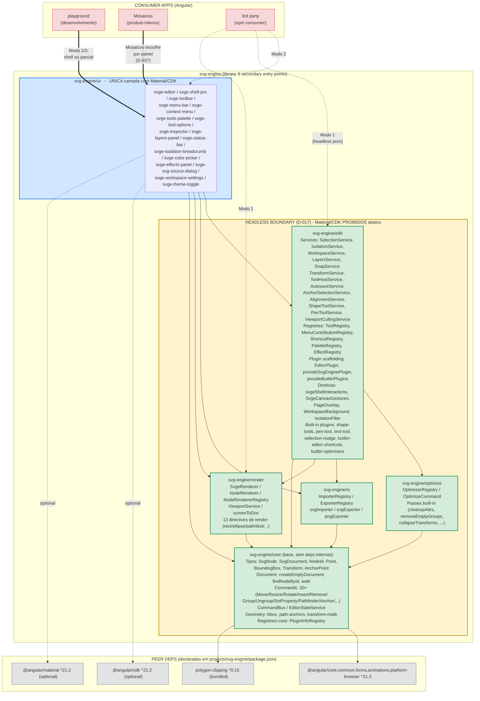
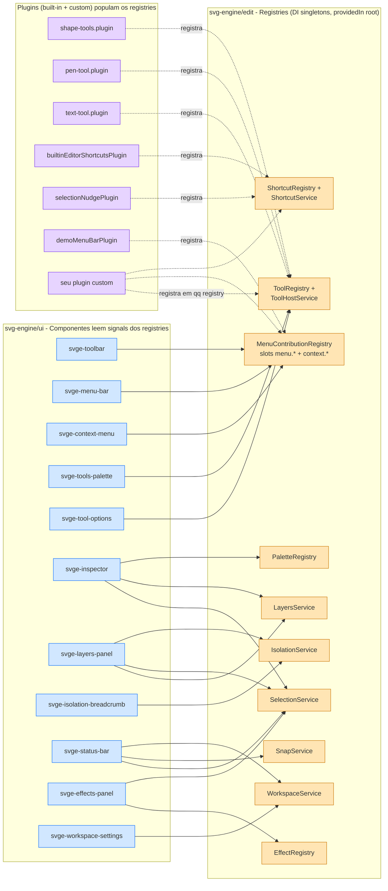
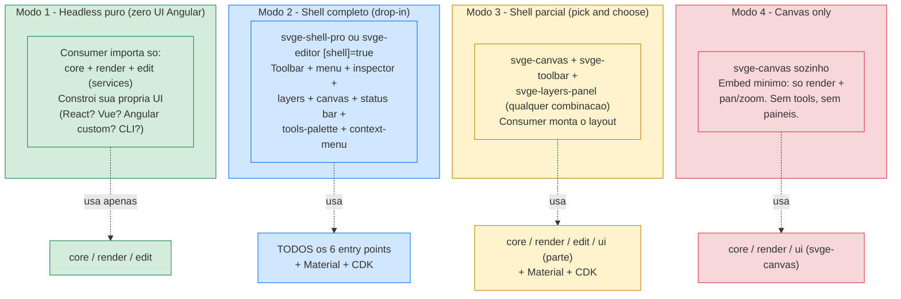

# 02 — Arquitetura

## 1. Visão macro

O **SVGEngine** é um **workspace Angular v21** contendo:

- Uma **library** publicável: `svg-engine` (núcleo + UI do editor).
- Uma **aplicação demo** consumidora: `playground` (Angular Material).

## 2. Estrutura real após Fase 1 (2026-05-14)

```
SVGEngine/
├── .claude/
│   ├── CLAUDE.md                  # guia de boas práticas Angular (auto-gerado)
│   ├── launch.json                # config do dev server para preview tools
│   └── settings.json              # restrições do agente (deny rules)
├── .vscode/
│   ├── extensions.json
│   ├── launch.json
│   ├── mcp.json                   # MCP server do Angular CLI
│   └── tasks.json
├── docs/                          # documentação canônica (01..08)
├── projects/
│   ├── svg-engine/                # library (--prefix=svge)
│   │   ├── src/
│   │   │   ├── lib/
│   │   │   │   ├── svg-engine.ts        # placeholder gerado pelo schematic
│   │   │   │   └── svg-engine.spec.ts
│   │   │   └── public-api.ts            # superfície pública da library
│   │   ├── ng-package.json
│   │   ├── package.json
│   │   ├── tsconfig.lib.json
│   │   ├── tsconfig.lib.prod.json
│   │   └── tsconfig.spec.json
│   ├── playground/                # app demo (--prefix=app, --routing, --style=scss)
│   │   ├── public/                # assets estáticos (favicon, etc.)
│   │   ├── src/
│   │   │   ├── app/
│   │   │   │   ├── app.config.ts        # provedores raiz (30+ plugins, incl. stampToolPlugin demo)
│   │   │   │   ├── app.routes.ts        # 8 rotas + 6 redirects legados + catch-all
│   │   │   │   ├── app.ts
│   │   │   │   ├── app.html             # header banner + <router-outlet>
│   │   │   │   ├── app.scss
│   │   │   │   └── app.spec.ts
│   │   │   ├── index.html               # links Roboto + Material Icons
│   │   │   ├── main.ts                  # bootstrapApplication
│   │   │   └── styles.scss              # tema M3 azure-blue + light dark
│   │   ├── tsconfig.app.json
│   │   └── tsconfig.spec.json
│   └── svg-studio/                # app produto (--prefix=studio) — adicionado 2026-05-28
│       ├── public/                # favicon
│       ├── src/
│       │   ├── app/
│       │   │   ├── app.config.ts        # set de plugins espelhado do playground MENOS demos
│       │   │   ├── app.routes.ts        # 1 rota só ('/') + catch-all redirect (deep-links ⇒ editor)
│       │   │   ├── app.ts               # full-bleed sem header
│       │   │   └── pages/pro-editor/    # único componente, providers: [provideSvgEngineEditorScope()]
│       │   ├── index.html
│       │   ├── main.ts
│       │   └── styles.scss
│       ├── tsconfig.app.json
│       └── tsconfig.spec.json
├── .editorconfig
├── .gitignore
├── .prettierrc
├── angular.json                   # 3 projetos: svg-engine, playground, svg-studio
├── package.json                   # @angular/* @21.2.0, @angular/material @21.x
└── tsconfig.json                  # strict + strictTemplates + flags fortes
```

**Por que 2 apps consumidores** (D-041 follow-up de 2026-05-28):

- **`playground`**: sandbox+showcase para devs integrando a library — mostra todos os modos D-037, inclui plugins demo (`stampToolPlugin`), tem 8 rotas explicando cada Modo, redirects legados de URLs antigas. Audiência: plugin author, dev integrando.
- **`svg-studio`**: deliverable de produto — full-bleed `<svge-shell-pro>` puro, 1 rota só, set de plugins espelhado do playground **menos** demos pedagógicos, deep-links sempre caem no editor. Audiência: end-user.

A coexistência prova um princípio importante do D-041: a library serve dois consumers reais (showcase + produto) sem precisar de fork — só configurações diferentes de `provideSvgEnginePlugin(...)` no bootstrap.

## 3. Estrutura-alvo: multi-entry-point (D-018)

Library dividida em **secondary entry points** via `ng-packagr` para
permitir consumo headless (D-017) e tree-shaking real:

```
projects/svg-engine/
├── ng-package.json                 # primary entry (agregador)
├── package.json
├── src/public-api.ts               # re-exporta de */public-api.ts
├── core/
│   ├── ng-package.json
│   └── src/
│       ├── public-api.ts           # surface de svg-engine/core
│       └── lib/
│           ├── model/              # SvgNode, RectNode, GroupNode, ...
│           ├── commands/           # Command pattern + concrete commands
│           ├── history/            # HistoryService (undo/redo)
│           ├── state/              # EditorStateService (signals)
│           └── types/              # tipos compartilhados (Transform, BBox, ...)
├── render/
│   ├── ng-package.json
│   └── src/
│       ├── public-api.ts           # surface de svg-engine/render
│       └── lib/
│           ├── renderer/           # <svge-renderer> (viewer read-only)
│           └── viewport/           # ViewportService (pan/zoom)
├── io/
│   ├── ng-package.json
│   └── src/
│       ├── public-api.ts
│       └── lib/
│           ├── parser/             # string SVG -> SvgNode tree
│           ├── serializer/         # SvgNode tree -> string SVG
│           └── sanitizer/          # remove scripts/eventos, valida hrefs
├── optimize/
│   ├── ng-package.json
│   └── src/
│       ├── public-api.ts
│       └── lib/
│           ├── passes/             # PathOptimizer, Deduper, Minifier, ...
│           └── pipeline/           # composição de passes configurável
├── edit/
│   ├── ng-package.json
│   └── src/
│       ├── public-api.ts
│       └── lib/
│           ├── selection/          # SelectionService + handles
│           ├── transform/          # drag/resize/rotate/scale + snap/align
│           ├── canvas/             # <svge-canvas> (renderer + interações)
│           └── plugins/            # API de plugins
└── ui/
    ├── ng-package.json
    └── src/
        ├── public-api.ts
        └── lib/
            ├── toolbar/            # <svge-toolbar>
            ├── layers-panel/       # <svge-layers-panel>
            ├── inspector/          # <svge-inspector>
            ├── palette/            # <svge-color-palette>
            └── theme/              # tokens, light/dark toggle (D-012)
```

### Dependências entre entry points (regra inviolável — D-017)

```
ui      → edit, render, io, optimize, core   (+ @angular/material)
edit    → render, core
render  → core
io      → core
optimize→ core, io
core    → (nenhum entry interno; apenas @angular/core)
```

`core/`, `render/`, `io/`, `optimize/`, `edit/` **não importam** de
`@angular/material` nem de `@angular/cdk`. Apenas `ui/` e a
`playground` podem.

### Consumo por terceiros — exemplos

```ts
// Caso 1 — render-only (viewer leve)
import { SvgRenderer } from 'svg-engine/render';

// Caso 2 — manipulação programática (headless, sem UI)
import { EditorStateService, MoveNodeCommand } from 'svg-engine/core';
import { SvgParser } from 'svg-engine/io';

// Caso 3 — otimização standalone (CLI/server-side futuro)
import { OptimizationPipeline, PathOptimizer } from 'svg-engine/optimize';

// Caso 4 — editor completo (consumo Mosaicoo / playground)
import { SvgEditorComponent } from 'svg-engine/ui';
```

### Princípios inegociáveis

- **Toda feature nasce na library**; a `playground` apenas consome.
- **Headless-first**: nada do core/render/io/optimize/edit pode forçar
  a inclusão de Material no bundle do consumidor.
- `public-api.ts` é a **única** superfície exportada por entry point.
  Internos não vazam.

## 4. Mapa de dependências (verificado por código)

> Os diagramas abaixo refletem a **estrutura real** do repositório
> (verificada via `grep "from 'svg-engine/(core|render|io|optimize|edit|ui)'"`).
> Renderizam nativamente no GitHub, VS Code (com a extensão Markdown
> Preview Mermaid Support) e na maioria das plataformas modernas.

### 4.1 Visão macro — entry points, consumers e peer deps



**Convenção de setas**:

| Estilo               | Significado                           |
| -------------------- | ------------------------------------- |
| Grossas (`==>`)      | Consumer instalado por padrão         |
| Pontilhadas (`-.->`) | Caminho opcional / por modo           |
| Finas (`-->`)        | Import direto (`from 'svg-engine/X'`) |

**Regras invioláveis codificadas no grafo**:

1. **D-017 Headless boundary**: tudo abaixo de `ui` é Material-free e CDK-free. Verificado: **todos** os 16 arquivos que importam `@angular/material|cdk` estão em `svg-engine/ui`.
2. **Sem ciclos**: `core` não importa ninguém de `svg-engine/*`. `render`, `io`, `optimize` só importam `core`. `edit` importa `core+render+io+optimize`. `ui` é o topo.
3. **`polygon-clipping`** está em `core` (motor de pathfinder boolean ops) — bundled como dep direta, não peer.
4. **Material + CDK são `optional` peer deps** — consumer headless (Modo 1) não precisa instalá-los.

### 4.2 Zoom — como `ui` se conecta ao `edit` (registries + plugins)



**Padrão arquitetural**: registries em `edit` são a **fonte de verdade**; componentes em `ui` apenas **lêem**. Plugins (built-in ou de terceiros) **populam** os registries via `EditorPlugin.install(ctx)`. Nenhum componente UI tem lista hardcoded de tools/menus/shortcuts — toda funcionalidade aparece via registro dinâmico.

### 4.3 Os 4 modos de consumo (D-037)



### 4.4 Tabela de referência rápida — o que cada entry point possui

| Entry point | Owns                                                                                                                                                                                                 | Material? | Imports de svg-engine/\*           |
| ----------- | ---------------------------------------------------------------------------------------------------------------------------------------------------------------------------------------------------- | :-------: | ---------------------------------- |
| `core`      | tipos, document, commands, CommandBus, EditorStateService, geometry                                                                                                                                  |    Não    | — (base)                           |
| `render`    | SvgeRenderer, ViewportService, 13 directives de render, screenToDoc                                                                                                                                  |    Não    | `core`                             |
| `io`        | ImporterRegistry, ExporterRegistry, svgImporter, svgExporter, pngExporter                                                                                                                            |    Não    | `core`                             |
| `optimize`  | OptimizerRegistry, OptimizeCommand, builtin optimizers                                                                                                                                               |    Não    | `core`                             |
| `edit`      | services (Selection/Isolation/Layers/Snap/Workspace/Transform/...), registries (Tool/Menu/Shortcut/Palette/Effect), plugin scaffolding, shell-interactions directive, built-in tool/shortcut plugins |    Não    | `core`, `render`, `io`, `optimize` |
| `ui`        | TODOS os 16 componentes Angular Material (toolbar, menu-bar, inspector, layers-panel, status-bar, shell-pro, editor, ...)                                                                            |    Sim    | `core`, `render`, `io`, `edit`     |

### 4.5 Como manter esses diagramas em dia

Quando adicionar/remover entry points, services, registries ou alterar imports cross-entry-point, **atualize esta seção** no mesmo PR. Comando para reverificar a fronteira headless:

```bash
# Deve retornar apenas arquivos em svg-engine/ui/:
grep -r "from '@angular/(material|cdk)" projects/svg-engine/
```

Comando para reverificar grafo de deps interno:

```bash
# Mostra todos os imports cross-entry-point:
grep -rn "from 'svg-engine/" projects/svg-engine/
```

---

## 2. Camadas internas da library

### 2.1 `core/` — Núcleo independente de UI

- **Modelo**: árvore de nós (`SvgNode`) — tipos como `RectNode`,
  `EllipseNode`, `PathNode`, `GroupNode`, `TextNode`, `ImageNode`.
- **Estado**: `EditorStateService` (signals do Angular como fonte de verdade).
- **Comandos**: pattern Command para mutações (cada ação = comando reversível).
- **Histórico**: `HistoryService` com undo/redo baseado em pilhas de comandos.
- **IDs**: gerador determinístico por sessão (auditável; sem `Math.random`).

### 2.2 `canvas/` — Renderização e viewport

- Componente `<svg-canvas>` que renderiza a árvore via templates Angular
  (não manipulação DOM imperativa, exceto onde necessário por
  performance — registrado caso a caso).
- Pan/zoom via matriz de transformação aplicada no `<svg viewBox>`.
- Camadas de overlay separadas: conteúdo, seleção, handles, snap-guides.

### 2.3 `selection/` + `transform/`

- `SelectionService` mantém set de IDs selecionados.
- `transform/` aplica operações via comandos (sempre passam pelo
  `HistoryService`).

### 2.4 `layers/`, `inspector/`, `toolbar/`, `palette/`

- Componentes Angular Material puros, **sem lógica de negócio inline**:
  consomem serviços de `core/` e despacham comandos.

### 2.5 `io/`

- Import: parser SVG → árvore de `SvgNode` com **sanitização**
  (script/eventos removidos; `xlink:href` validado).
- Export: serialização determinística (mesma entrada → mesma saída byte-a-byte).

### 2.6 `plugins/`

- Interface `EditorPlugin` com hooks (`onInit`, `registerTool`,
  `registerCommand`, `registerInspectorPanel`).
- Carregamento declarativo via `provideSvgEngine({ plugins: [...] })`.

## 3. Princípios arquiteturais

1. **Separação UI ↔ estado**: componentes não mutam estado direto;
   despacham comandos.
2. **Imutabilidade no modelo**: nós são tratados como imutáveis;
   mutações geram nova versão (estrutural sharing onde fizer sentido).
3. **Signals primeiro**: estado reativo via Angular signals; RxJS
   só onde houver necessidade real (eventos do DOM, async).
4. **Standalone components**: sem `NgModule` (Angular moderno).
5. **Tree-shakable**: `public-api.ts` exporta apenas o necessário;
   internos não vazam.
6. **Sem efeitos colaterais no import**: nenhum side-effect em top-level
   de arquivos da library.
7. **Testabilidade**: serviços puros injetáveis; componentes finos.

## 4. Decisões pendentes

- Estratégia de teste (Karma vs Vitest vs Web Test Runner).
- Estratégia de build da library (apenas `ng-packagr` ou customizar).
- Estratégia de versionamento (SemVer + changelog automatizado?).
- Registry de publicação (npm público, GitHub Packages, registry interno).

> Cada decisão acima vira uma entrada em `04-decisoes-tecnicas.md` quando resolvida.
